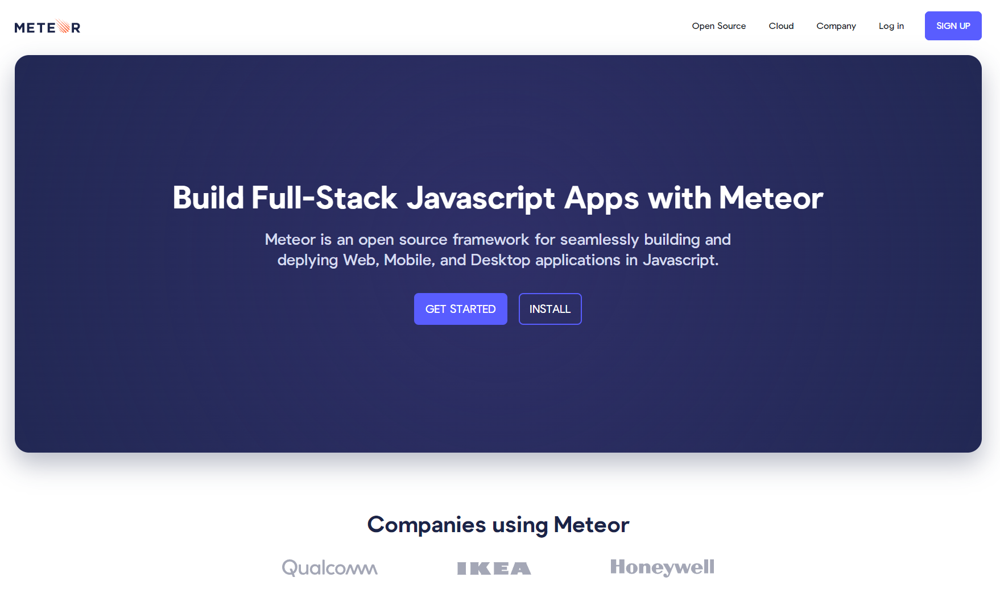

# Meteor Homepage Duplication

Source code for my [Meteor Homepage Duplication](https://meteor.timkrause.dev/), built with [React](https://reactjs.org/) and modeled off of the homepage for [Meteor](https://www.meteor.com/).

## Overview

In this front-end project, I worked to duplicate Meteor's landing page including styling and animation. A few styling and typo bugs were also found during this project, which were then reported to Meteor. This project was bootstrapped with [Create React App](https://github.com/facebook/create-react-app) and deployed to [Firebase](https://firebase.google.com/).

## Technology Used
The technology used to create this portfolio include:

- React
- SASS

## Contact
If you have any questions about the front-end project, my work or if you have any opportunities you would I would be a good fit for, please [contact me](https://timkrause.dev/#contact).
